<h1 align="center">Cosmoduck niri</h1>

<p align="center">
  A complete, themed <a href="https://github.com/YaLTeR/niri">niri</a> Wayland
  desktop for <b>Ubuntu 22.04 LTS (jammy)</b> — where niri isn't packaged and
  half the stack is too old to run it.
</p>

<p align="center">
  <!-- Replace with a real hero shot once captured (docs/screenshots/) -->
  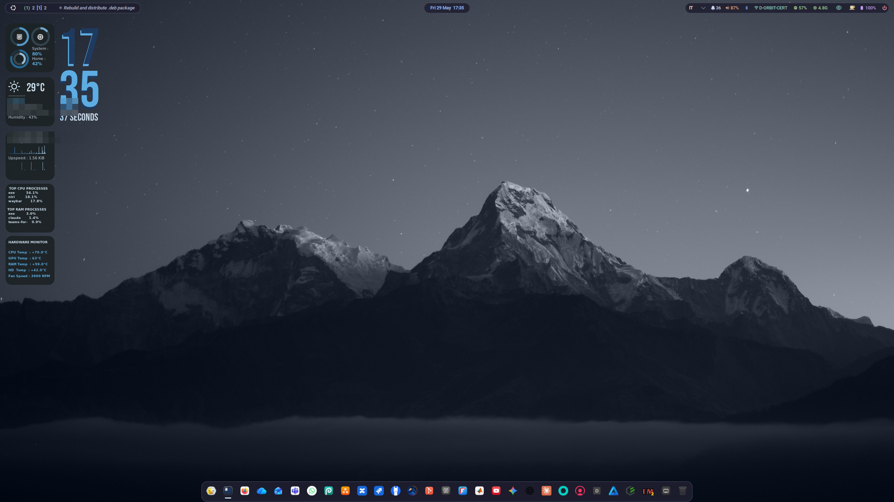
</p>

---

## Why this exists

niri is a scrollable-tiling Wayland compositor. On Ubuntu 24.04+ you just install
it. On **22.04 LTS** you can't — and it's not only missing from the repos, the
surrounding stack is too old to even build/run it cleanly:

- **libinput < 1.27** has no `dwtp` config symbol niri expects → niri won't link.
- **libwayland 1.20** lacks high-resolution scroll (`axis_value120`) → Firefox
  aborts under niri with *"wl_pointer has no event 9"*.
- **libdisplay-info** isn't packaged at all → niri has no EDID parsing.
- **Xwayland** is too old for the protocol versions niri speaks.
- **swaylock 1.5** relies on the deprecated input-inhibitor protocol → no lock.

This repo is the result of backporting the whole thing: the compositor and its
toolchain compiled from source with the needed patches, plus a full ricing
("Cosmoduck") on top — theme, waybar bar + macOS-style dock, swaync, and a conky
widget bridged onto niri's background layer.

> jammy is supported until 2027 and is everywhere (labs, locked-down hardware,
> machines that can't move off an LTS). This is for people stuck there who still
> want a modern Wayland desktop.

## Two ways to install

### 🦆 The lazy way — prebuilt `.deb` (rice included)

Everything compiled, themed and ready. You get the desktop exactly as in the
screenshots.

Grab the `.deb` from the [**latest release**](https://github.com/msavox/cosmoduck-niri/releases/latest), then:

```bash
sudo apt install ./cosmoduck-niri_1.3.0_amd64.deb   # pulls all runtime deps
cosmoduck-niri-setup                                 # run as your user, NOT sudo
```

Log out, pick the **niri** session at the login screen. Done.

### 🔧 The builder way — compile from source

For people who want to read every patch and build it themselves. See
[`build/README.md`](build/README.md).

```bash
./build/00-deps.sh      # toolchain + -dev packages (sudo, once)
./build/build-all.sh    # compile + install the whole stack into /usr/local
./rice/setup.sh         # install the rice for your user
```

You can rebuild the `.deb` yourself afterwards with
[`packaging/build-deb.sh`](packaging/build-deb.sh).

## What you get

| | |
|---|---|
| **Compositor** | niri `v26.04` + jammy patches |
| **Bar & dock** | waybar top bar with a macOS-style close-window button, plus a macOS-style pinned dock with running indicators that split into one segment per open window, per-app notification badges, a right-click context menu (New Window / focus each instance / Close / Force Quit), and adjustable height (slider in the dock manager); every shell context menu (dock, tray, desktop) shares one framework with monochrome symbolic icons and flyout submenus |
| **Desktop** | real desktop icons on niri (layer-shell surface between wallpaper and tiles): `~/Desktop` grid aligned top-right macOS-style, double-click to open, click / Ctrl-click / rubber-band marquee selection, keyboard (Delete → trash, Shift+Delete → permanent, Ctrl+A, Enter, Esc), full drag & drop (reposition, drag files onto other apps **and onto dock icons** — drop on the bin trashes in batch, drop on an app opens the files with it — plus drop external files in), right-click menu — New › submenu (text/markdown/shell/python/Word/Excel/PowerPoint/GanttProject + your `~/Templates`), Cut/Copy/Paste, Rename, Trash, Properties, Open with…, sort, free/grid arrangement with nearest-cell Snap to Grid, icon-size submenu, hide icons — and an animated `Mod+Shift+D` show-desktop toggle |
| **App grid** | Launchpad-style application grid on the Ubuntu button in the top bar (non-fullscreen, search-as-you-type, arrow navigation), dressed like ulauncher's macos theme; ulauncher itself stays on `Ctrl+Space` / `Mod+D` |
| **Notifications** | SwayNotificationCenter (swaync); clicking a notification focuses the source app's window |
| **Lock** | swaylock-effects over a blurred wallpaper, with the Cosmoduck duck composited in the lock ring |
| **Boot splash** | Plymouth "cosmoduck" theme — duck + loading bar over a scrolling kernel/systemd log (set up automatically; reverts on uninstall) |
| **Widget** | conky "Cosmoduck" bridged onto niri's background layer |
| **Cheatsheet** | custom 3-column keyboard cheatsheet (F1), auto-built from your keybinds, shown at first login |
| **Theme** | `cosmoduck-*` GTK theme (WhiteSur fork, blue window buttons), Bibata cursor, CaskaydiaCove Nerd Font |
| **Extras** | lid keep-awake toggle, GNOME wallpaper sync, nwg-displays monitor config |

## Gallery

**Scrollable tiling** — columns scroll horizontally instead of cramming onto one screen:

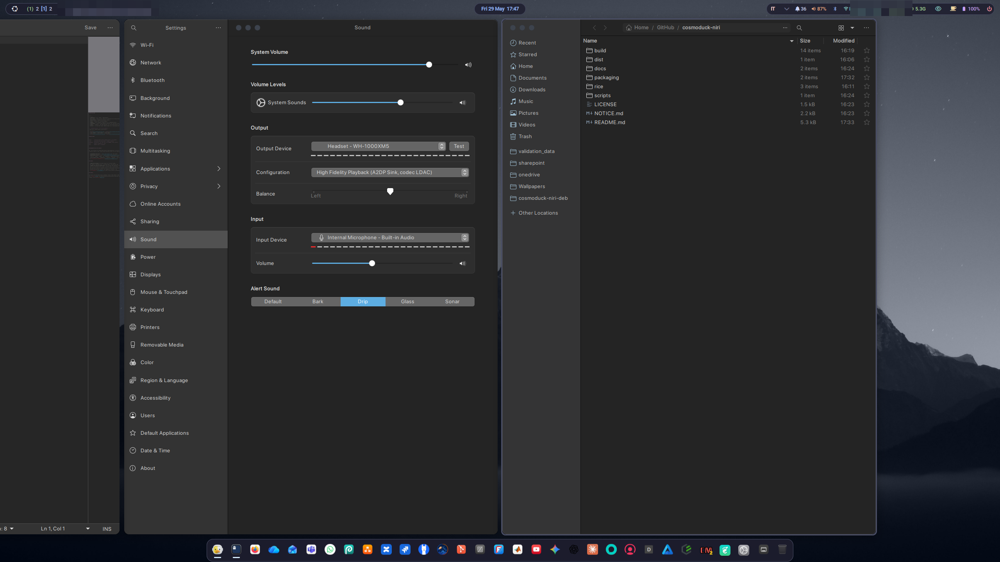

**macOS-style dock** (pinned apps + running indicators + trash) and the **top bar** (workspaces, the blue close-window button, window title, tray, custom modules — ☕ lid keep-awake, 👁 conky toggle, volume):

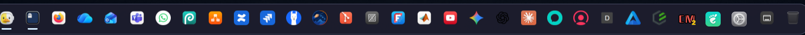
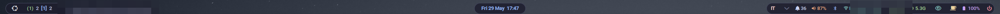

**Dock manager** — pin/unpin apps and tune the dock height with a slider:

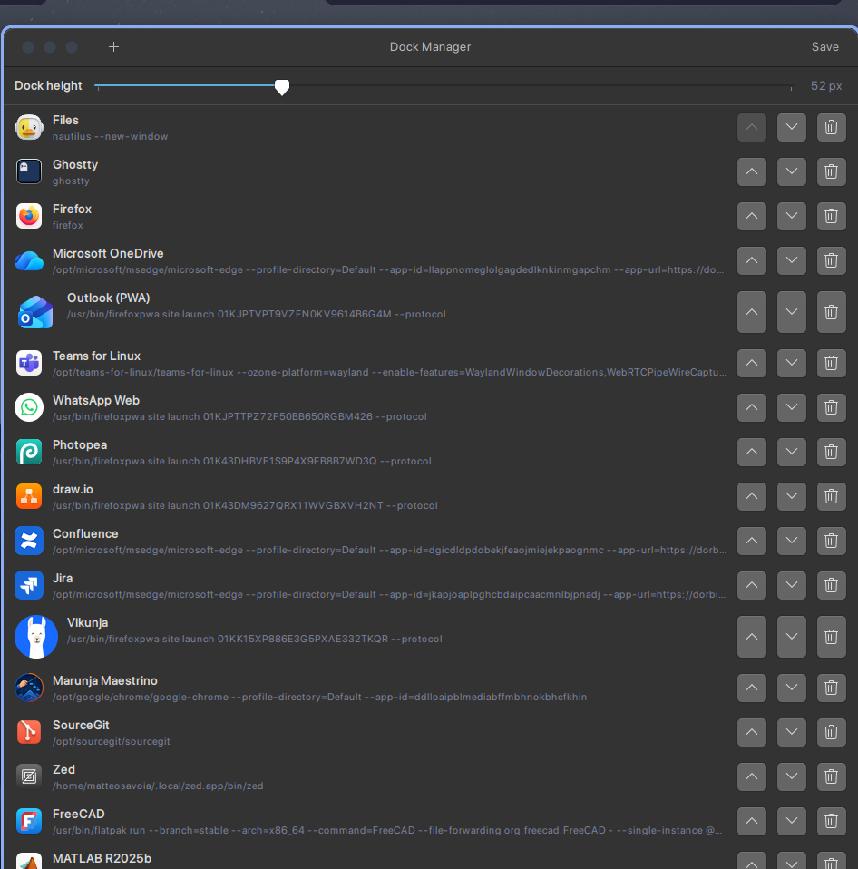

**Desktop icons** — `~/Desktop` rendered on niri's bottom layer (top-right macOS-style), with the right-click context menu and its icon-size submenu open:

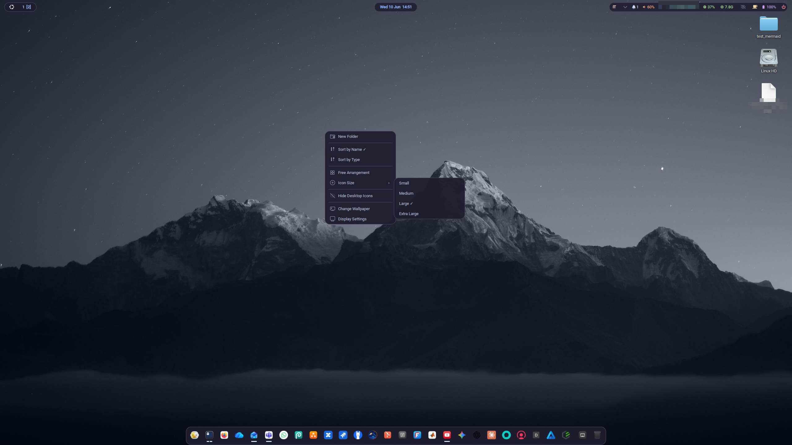

**App grid launcher** (`Mod+A` or the Ubuntu button) — Launchpad-style, non-fullscreen, search-as-you-type, with the same focus-ring bezel niri draws around windows:

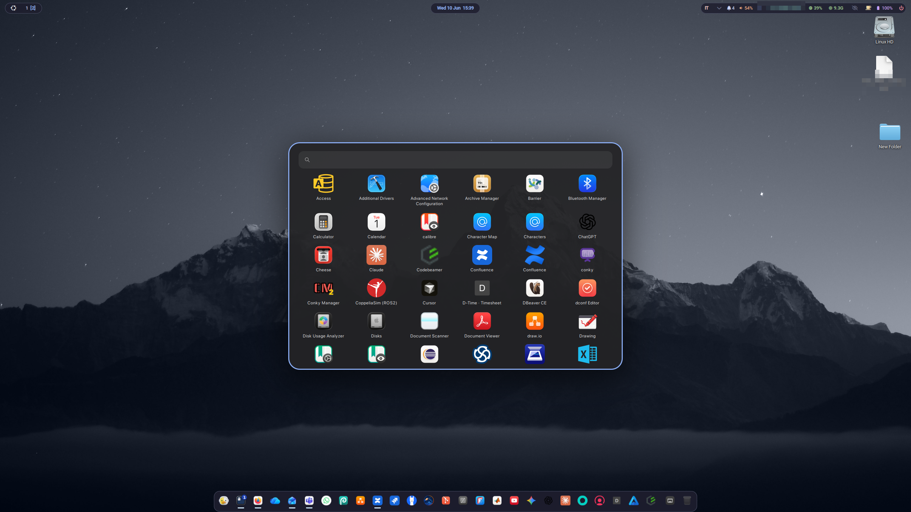

**Keyboard cheatsheet** (F1) — auto-built from your keybinds, shown at first login:

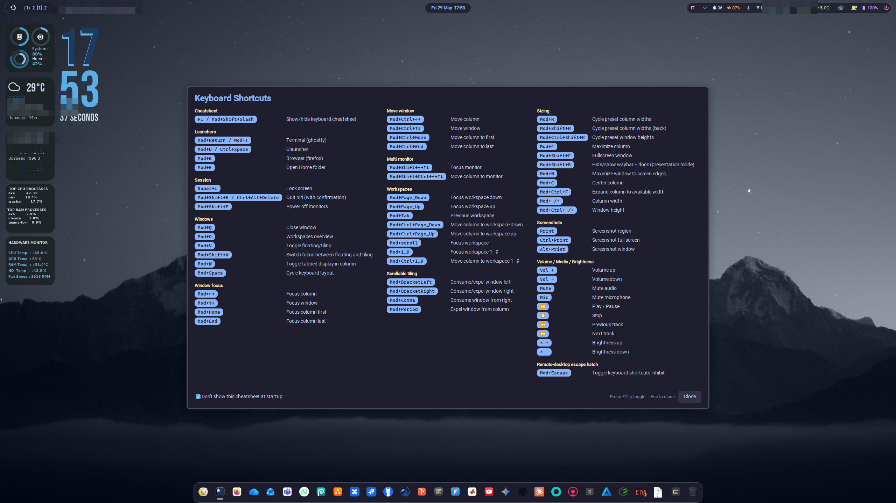

| Notifications (swaync) | Calendar popup | conky widget |
|:---:|:---:|:---:|
| 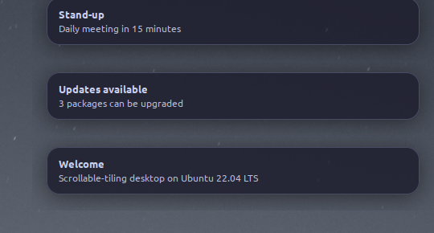 | 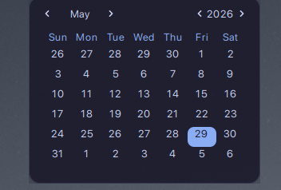 | 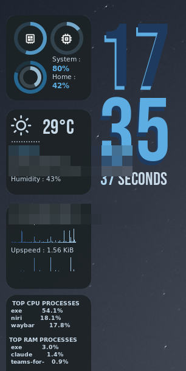 |

**Lock screen** (swaylock-effects, duck in the ring over the blurred wallpaper) and the **Plymouth boot splash** (duck + loading bar over the scrolling kernel log):

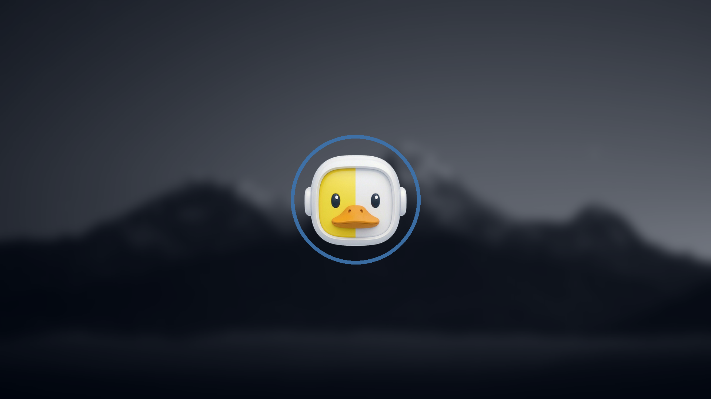
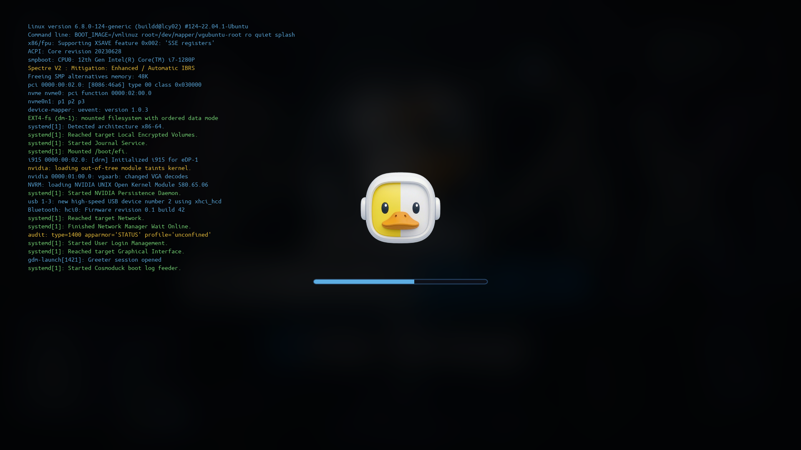

**Light theme** (`cosmoduck-Light`) and the theme's blue macOS-style window buttons:

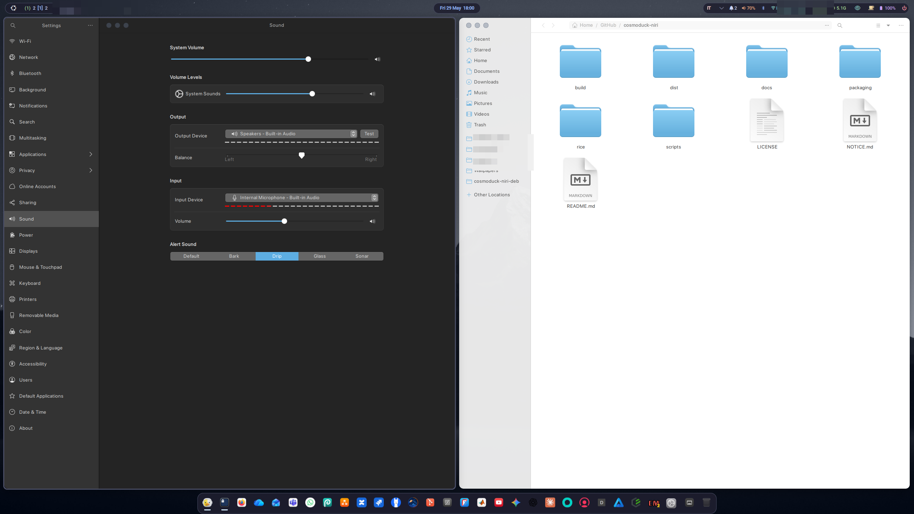
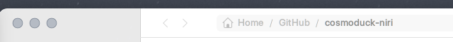

## Repo layout

```
build/       from-source build scripts (pinned versions + niri patches)
rice/        de-personalized config (skel/) + themes + setup.sh
packaging/   build-deb.sh + the .deb static tree (DEBIAN/, setup, presets)
             (the prebuilt .deb is attached to GitHub Releases, not committed)
docs/        backport notes + screenshots
```

## Dependencies the rice expects

The `.deb` declares its runtime deps and pulls them automatically. If you go the
clone-and-`setup.sh` route, install these third-party assets for full fidelity:

- **CaskaydiaCove Nerd Font** — <https://www.nerdfonts.com/> (bar glyphs)
- **Bibata-Modern-Classic** cursor — <https://github.com/ful1e5/Bibata_Cursor>
- `conky-all`, `waybar`, `swaybg`, `jq`, `python3-gi`, `gnome-control-center`,
  `network-manager-gnome`, `brightnessctl`, `playerctl`, `ulauncher` … (full list
  in [`packaging/static/DEBIAN/control`](packaging/static/DEBIAN/control)).

## Caveats

- **jammy-only by design.** On 24.04+ install niri from apt instead.
- The compiled `libwayland-client` is installed under `/usr/local/lib` and
  **shadows the system one machine-wide** (newer upstream, ABI-compatible). It's
  the fix for the Firefox scroll crash; if you don't want it, drop step 01.
- The from-source scripts for components 02–07 are reconstructed from the build
  provenance and may need a missing `-dev` package on a fresh box — see
  [`build/README.md`](build/README.md) for what's battle-tested vs reconstructed.
- **The `.deb` sets the Plymouth boot splash to "cosmoduck"** (via
  `update-alternatives`) and **rebuilds the initramfs** on install — so the first
  install takes a little longer. Uninstalling reverts the splash and rebuilds the
  initramfs again. The kernel log is read from `/dev/kmsg`, so GRUB's `quiet` is
  left untouched.

## License

This repo's own code (build scripts, packaging, configs, theme tweaks) is MIT —
see [`LICENSE`](LICENSE). The bundled/compiled upstream projects keep their own
licenses — see [`NOTICE.md`](NOTICE.md).
